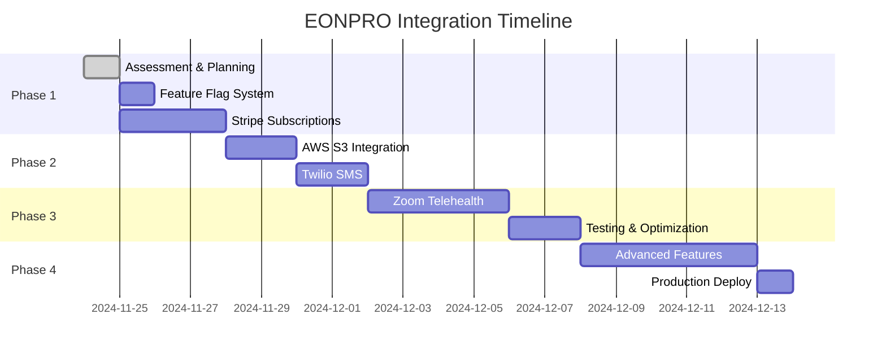

# 📊 Complete Integration Inventory

## 📋 EONPRO vs Lifefile Feature Comparison

| Integration | EONPRO (Available) | Lifefile (Current) | Action Required | Priority | Risk |
|------------|-------------------|-------------------|-----------------|----------|------|
| **Stripe Payments** | ✅ Full (Subscriptions, Connect, Invoices) | ✅ Basic (One-time payments) | Enhance with subscriptions | HIGH | LOW |
| **Square Payments** | ✅ Full SDK | ❌ None | Optional - evaluate need | LOW | LOW |
| **Twilio SMS** | ✅ Full | ❌ None | Add notification system | HIGH | MEDIUM |
| **Twilio Chat** | ✅ Real-time chat | ❌ None | Add patient-provider chat | MEDIUM | HIGH |
| **Zoom Video** | ✅ Full SDK + Toolkit | ❌ None | Add telehealth | HIGH | MEDIUM |
| **AWS S3** | ✅ File storage | ❌ Local storage only | Migrate to cloud | HIGH | LOW |
| **AWS SES** | ✅ Email service | ❌ None | Add transactional emails | MEDIUM | LOW |
| **AWS EventBridge** | ✅ Event scheduling | ❌ None | Add appointment automation | LOW | MEDIUM |
| **Keycloak Auth** | ✅ Full RBAC | ✅ Basic JWT | Enhance roles/permissions | MEDIUM | HIGH |
| **PostgreSQL** | ✅ With Liquibase | ✅ With Prisma | Keep Prisma | N/A | N/A |
| **Docker** | ✅ Full containerization | ❌ None | Add for deployment | LOW | LOW |
| **DoseSpot** | ✅ E-Prescribing API | ❌ None | Research integration | LOW | HIGH |
| **Custom Forms** | ✅ Dynamic form builder | ✅ Basic intake forms | Enhance form system | MEDIUM | MEDIUM |
| **Reporting** | ✅ Analytics dashboard | ❌ Basic | Add analytics | MEDIUM | LOW |
| **Multi-language** | ✅ i18n support | ❌ English only | Add internationalization | LOW | LOW |

## 🎯 Extraction Checklist

### ✅ Ready to Extract (Low Risk)
- [ ] Stripe React components (`stripePayment.tsx`, `checkoutForm.tsx`)
- [ ] AWS S3 upload logic (convert from Java)
- [ ] Email templates from SES
- [ ] Zoom UI components (`ZoomToolkit/`)
- [ ] Custom form components
- [ ] Phone number validation (`custom-phone-number/`)
- [ ] Date/Time pickers (`custom-date-picker/`, `custom-time-picker/`)

### ⚠️ Needs Adaptation (Medium Risk)
- [ ] Twilio SMS service (Java → TypeScript)
- [ ] Redux store → React Context/Zustand
- [ ] Keycloak patterns → JWT enhancement
- [ ] Appointment scheduling logic
- [ ] Notification system

### 🔴 Complex Extraction (High Risk)
- [ ] Twilio Chat (WebSocket handling)
- [ ] Video consultation flow
- [ ] Multi-provider group management
- [ ] DoseSpot integration
- [ ] Complete microservices architecture

## 📁 File Mapping

### Stripe Integration Files
```
EONPRO:
├── ehr-portal-stage/src/pages/apps/patient/pages/payment-gateway/
│   ├── stripePayment.tsx (317 lines)
│   ├── checkoutForm.tsx
│   └── subscribePlans.tsx
├── master-service-stage/src/main/java/com/eonmeds/master/integration/payment/stripe/
│   ├── service/StripeAccountService.java
│   ├── service/StripeSubscriptionService.java
│   └── controller/StripeController.java

LIFEFILE TARGET:
└── src/components/stripe/
    ├── SubscriptionForm.tsx (new)
    ├── PaymentElement.tsx (new)
    └── ConnectOnboarding.tsx (new)
```

### Twilio Integration Files
```
EONPRO:
├── ehr-portal-stage/src/twilio-chat/
│   ├── chat.tsx
│   └── ChatPage.tsx
├── master-service-stage/src/main/java/com/eonmeds/master/config/
│   └── TwilioConfig.java

LIFEFILE TARGET:
└── src/components/chat/
    ├── TwilioChat.tsx (new)
    └── MessageThread.tsx (new)
```

### Zoom Integration Files
```
EONPRO:
├── ehr-portal-stage/src/ZoomToolkit/
│   ├── join-room.tsx (461 lines)
│   ├── ConfirmationPopUp.tsx
│   ├── minimise-maximise.tsx
│   └── zoom-toolkit.css

LIFEFILE TARGET:
└── src/components/telehealth/
    ├── VideoConsultation.tsx (new)
    ├── WaitingRoom.tsx (new)
    └── CallControls.tsx (new)
```

## 🔧 Technical Dependencies to Add

### Package.json Additions Needed
```json
{
  "dependencies": {
    // Stripe (already have latest)
    "@stripe/react-stripe-js": "^3.3.40",
    
    // Twilio
    "@twilio/conversations": "^2.6.2",
    "twilio": "^5.2.2",
    
    // Zoom
    "@zoom/videosdk": "^2.1.10",
    "@zoom/videosdk-ui-toolkit": "^2.2.0",
    
    // AWS
    "@aws-sdk/client-s3": "^3.658.0",
    "@aws-sdk/client-ses": "^3.658.0",
    "@aws-sdk/client-eventbridge": "^3.658.0",
    
    // UI Components (optional)
    "@mui/material": "^6.4.11",
    "@mui/x-date-pickers": "^7.29.1",
    
    // State Management (if needed)
    "zustand": "^5.0.2",
    
    // Utilities
    "libphonenumber-js": "^1.12.23",
    "react-hook-form": "^7.54.2"
  }
}
```

## 🚀 Quick Start Commands

```bash
# 1. Create feature branch
git checkout -b feature/eonpro-integrations

# 2. Create integration structure
mkdir -p src/components/{stripe,twilio,zoom,aws}
mkdir -p src/lib/integrations
mkdir -p src/app/api/v2/{stripe,twilio,zoom,notifications}

# 3. Install new dependencies
npm install @twilio/conversations @zoom/videosdk @aws-sdk/client-s3

# 4. Copy first component (example)
cp "/Users/italo/Downloads/EONPRO INDIA EHR/ehr-portal-stage/src/pages/apps/patient/pages/payment-gateway/stripePayment.tsx" \
   "src/components/stripe/SubscriptionForm.tsx"

# 5. Add feature flag
echo "NEXT_PUBLIC_ENABLE_SUBSCRIPTIONS=false" >> .env.local
```

## 📈 Integration Timeline



## ⚠️ Critical Warnings

1. **DO NOT** copy Java files directly - they need TypeScript conversion
2. **DO NOT** replace working Lifefile features
3. **DO NOT** copy patient data or PHI from EONPRO
4. **DO NOT** use EONPRO's API keys or credentials
5. **ALWAYS** test in isolation before integration
6. **ALWAYS** maintain backward compatibility
7. **ALWAYS** use feature flags for new features

## ✅ Next Steps

1. **Executor**: Begin with feature flag implementation
2. **Create** integration branches as specified
3. **Extract** Stripe components first (lowest risk)
4. **Test** each component in isolation
5. **Document** all changes in scratchpad

---
*Generated: November 24, 2024*
*Source: EONPRO INDIA EHR System Analysis*
