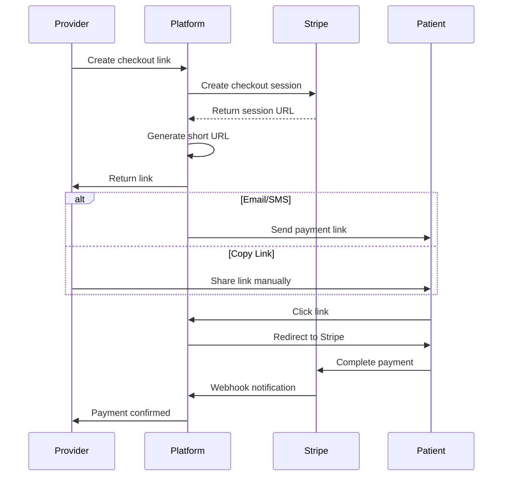
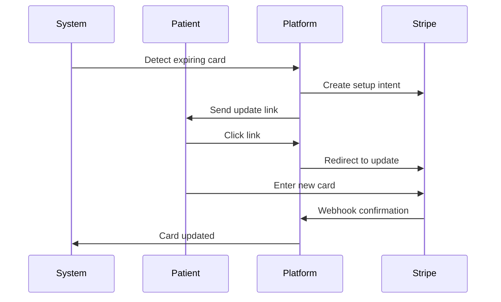

# Enterprise Billing System - Checkout Links & Card Management

## 🎯 Executive Summary

### Business Objectives

- **Reduce Payment Friction**: Enable providers to send payment links directly to patients
- **Improve Collection Rates**: Multiple communication channels (SMS, Email, Copy)
- **Card Update Management**: Proactive card update requests before expiration
- **Track Payment Performance**: Analytics on link usage and conversion rates

### Key Features

1. ✅ **Checkout Link Generation** - One-click payment link creation
2. ✅ **Multi-Channel Distribution** - SMS, Email, or manual sharing
3. ✅ **Card Update Links** - Secure card-on-file updates
4. ✅ **Real-time Tracking** - Click and conversion analytics
5. ✅ **Automated Expiration** - Auto-expire unused links
6. ✅ **PCI Compliance** - Secure, tokenized payments via Stripe

## 📊 System Architecture

```
┌─────────────────────────────────────────────────┐
│                   Frontend UI                    │
│  ┌────────────┐ ┌────────────┐ ┌────────────┐  │
│  │  Dashboard │ │    Link    │ │   Payment  │  │
│  │   Manager  │ │  Generator │ │   History  │  │
│  └────────────┘ └────────────┘ └────────────┘  │
└─────────────────────────────────────────────────┘
                        │
                        ▼
┌─────────────────────────────────────────────────┐
│                  API Layer                       │
│  ┌────────────┐ ┌────────────┐ ┌────────────┐  │
│  │  Checkout  │ │   Card     │ │   Link     │  │
│  │    API     │ │  Update    │ │  Tracking  │  │
│  └────────────┘ └────────────┘ └────────────┘  │
└─────────────────────────────────────────────────┘
                        │
                        ▼
┌─────────────────────────────────────────────────┐
│                Service Layer                     │
│  ┌────────────┐ ┌────────────┐ ┌────────────┐  │
│  │   Stripe   │ │   Comm.    │ │  Short URL │  │
│  │  Service   │ │  Service   │ │   Service  │  │
│  └────────────┘ └────────────┘ └────────────┘  │
└─────────────────────────────────────────────────┘
                        │
                        ▼
┌─────────────────────────────────────────────────┐
│              External Services                   │
│  ┌────────────┐ ┌────────────┐ ┌────────────┐  │
│  │   Stripe   │ │   Twilio   │ │  SendGrid  │  │
│  │    API     │ │    SMS     │ │   Email    │  │
│  └────────────┘ └────────────┘ └────────────┘  │
└─────────────────────────────────────────────────┘
```

## 🔄 User Flow Diagrams

### Checkout Link Flow



### Card Update Flow



## 💾 Database Schema

### Core Tables

```sql
-- Payment Links Table
CREATE TABLE payment_links (
    id UUID PRIMARY KEY,
    created_at TIMESTAMP NOT NULL DEFAULT NOW(),
    updated_at TIMESTAMP NOT NULL DEFAULT NOW(),

    -- Link Details
    stripe_url TEXT,
    short_url VARCHAR(10) UNIQUE NOT NULL,
    type VARCHAR(20) NOT NULL, -- CHECKOUT, CARD_UPDATE, SUBSCRIPTION
    status VARCHAR(20) NOT NULL, -- ACTIVE, EXPIRED, COMPLETED, CANCELLED

    -- Payment Info
    amount DECIMAL(10,2),
    currency VARCHAR(3) DEFAULT 'USD',
    description TEXT,
    metadata JSONB,

    -- Relations
    patient_id UUID REFERENCES patients(id),
    provider_id UUID REFERENCES providers(id) NOT NULL,
    customer_id VARCHAR(50), -- Stripe customer ID

    -- Tracking
    expires_at TIMESTAMP,
    completed_at TIMESTAMP,
    click_count INTEGER DEFAULT 0,
    last_clicked_at TIMESTAMP,

    -- Communication
    sent_via_email BOOLEAN DEFAULT FALSE,
    sent_via_sms BOOLEAN DEFAULT FALSE,
    email_sent_at TIMESTAMP,
    sms_sent_at TIMESTAMP,
    recipient_email VARCHAR(255),
    recipient_phone VARCHAR(20),

    -- Payment Result
    payment_intent_id VARCHAR(50),
    invoice_id VARCHAR(50),
    receipt_url TEXT
);

-- Click Tracking Table
CREATE TABLE payment_link_clicks (
    id UUID PRIMARY KEY,
    created_at TIMESTAMP NOT NULL DEFAULT NOW(),
    link_id UUID REFERENCES payment_links(id),
    ip_address INET,
    user_agent TEXT,
    referrer TEXT
);

-- Indexes for Performance
CREATE INDEX idx_payment_links_short_url ON payment_links(short_url);
CREATE INDEX idx_payment_links_status ON payment_links(status);
CREATE INDEX idx_payment_links_provider ON payment_links(provider_id);
CREATE INDEX idx_payment_links_patient ON payment_links(patient_id);
CREATE INDEX idx_payment_links_expires ON payment_links(expires_at);
```

## 🚀 Implementation Roadmap

### Phase 1: Foundation (Week 1)

- [ ] Database schema and migrations
- [ ] Stripe service integration
- [ ] Basic API endpoints
- [ ] Authentication middleware

### Phase 2: Core Features (Week 2)

- [ ] Checkout link generation
- [ ] Card update links
- [ ] Short URL service
- [ ] Link expiration logic

### Phase 3: Communication (Week 3)

- [ ] Email template system
- [ ] SMS integration
- [ ] In-app notifications
- [ ] Bulk sending capabilities

### Phase 4: UI/UX (Week 4)

- [ ] Dashboard components
- [ ] Link generator interface
- [ ] Analytics dashboard
- [ ] Mobile optimization

### Phase 5: Testing & Launch (Week 5)

- [ ] End-to-end testing
- [ ] Security audit
- [ ] Performance optimization
- [ ] Documentation

## 🛠️ Technical Implementation Details

### API Endpoints

#### 1. Create Checkout Link

```typescript
POST /api/billing/checkout-link
Authorization: Bearer {token}

Request:
{
  "amount": 150.00,
  "description": "Office Visit - March 15",
  "patientId": "patient_123",
  "items": [
    {
      "name": "Consultation",
      "price": 100.00,
      "quantity": 1
    },
    {
      "name": "Lab Work",
      "price": 50.00,
      "quantity": 1
    }
  ],
  "expiresIn": 72, // hours
  "sendVia": ["email", "sms"],
  "customMessage": "Please complete payment for your recent visit"
}

Response:
{
  "id": "link_abc123",
  "shortUrl": "https://pay.clinic/a1b2c3",
  "fullUrl": "https://checkout.stripe.com/...",
  "status": "ACTIVE",
  "expiresAt": "2024-03-18T15:00:00Z",
  "sentTo": {
    "email": "patient@email.com",
    "phone": "+1234567890"
  }
}
```

#### 2. Create Card Update Link

```typescript
POST /api/billing/card-update-link
Authorization: Bearer {token}

Request:
{
  "customerId": "cus_123456",
  "patientId": "patient_123",
  "reason": "Card expiring soon",
  "sendVia": ["email"]
}

Response:
{
  "id": "link_def456",
  "shortUrl": "https://pay.clinic/d4e5f6",
  "status": "ACTIVE",
  "type": "CARD_UPDATE"
}
```

#### 3. Get Link Analytics

```typescript
GET /api/billing/links/{linkId}/analytics
Authorization: Bearer {token}

Response:
{
  "linkId": "link_abc123",
  "clicks": 5,
  "uniqueClicks": 3,
  "conversionRate": 0.33,
  "averageTimeToPayment": 145, // seconds
  "clicksByDay": [
    { "date": "2024-03-15", "count": 3 },
    { "date": "2024-03-16", "count": 2 }
  ],
  "devices": {
    "mobile": 3,
    "desktop": 2
  }
}
```

### Service Layer Implementation

#### Stripe Payment Service

```typescript
import Stripe from 'stripe';
import { prisma } from '@/lib/db';
import { generateShortCode } from '@/lib/utils/shortUrl';

export class StripePaymentLinkService {
  private stripe: Stripe;

  constructor() {
    this.stripe = new Stripe(process.env.STRIPE_SECRET_KEY!, {
      apiVersion: '2023-10-16',
    });
  }

  async createCheckoutLink({
    amount,
    description,
    customerId,
    patientId,
    providerId,
    metadata,
    expiresIn = 72, // hours
  }: CreateCheckoutLinkParams): Promise<PaymentLink> {
    // Create Stripe checkout session
    const session = await this.stripe.checkout.sessions.create({
      payment_method_types: ['card'],
      line_items: [
        {
          price_data: {
            currency: 'usd',
            product_data: { name: description },
            unit_amount: Math.round(amount * 100),
          },
          quantity: 1,
        },
      ],
      mode: 'payment',
      success_url: `${process.env.NEXTAUTH_URL}/billing/success?session_id={CHECKOUT_SESSION_ID}`,
      cancel_url: `${process.env.NEXTAUTH_URL}/billing/cancel`,
      customer: customerId,
      metadata: {
        patientId,
        providerId,
        ...metadata,
      },
      expires_at: Math.floor(Date.now() / 1000) + expiresIn * 3600,
    });

    // Generate short URL
    const shortCode = await generateShortCode();

    // Save to database
    const paymentLink = await prisma.paymentLink.create({
      data: {
        stripeUrl: session.url,
        shortUrl: shortCode,
        type: 'CHECKOUT',
        status: 'ACTIVE',
        amount,
        description,
        metadata,
        patientId,
        providerId,
        customerId,
        expiresAt: new Date(Date.now() + expiresIn * 3600 * 1000),
      },
    });

    return paymentLink;
  }

  async createCardUpdateLink({
    customerId,
    patientId,
    providerId,
  }: CreateCardUpdateParams): Promise<PaymentLink> {
    // Create setup intent for card update
    const session = await this.stripe.checkout.sessions.create({
      payment_method_types: ['card'],
      mode: 'setup',
      customer: customerId,
      success_url: `${process.env.NEXTAUTH_URL}/billing/card-updated`,
      cancel_url: `${process.env.NEXTAUTH_URL}/billing/cancel`,
      metadata: {
        patientId,
        providerId,
        type: 'CARD_UPDATE',
      },
    });

    const shortCode = await generateShortCode();

    const paymentLink = await prisma.paymentLink.create({
      data: {
        stripeUrl: session.url,
        shortUrl: shortCode,
        type: 'CARD_UPDATE',
        status: 'ACTIVE',
        patientId,
        providerId,
        customerId,
        expiresAt: new Date(Date.now() + 30 * 24 * 3600 * 1000), // 30 days
      },
    });

    return paymentLink;
  }

  async handleWebhook(event: Stripe.Event): Promise<void> {
    switch (event.type) {
      case 'checkout.session.completed':
        await this.handleCheckoutCompleted(event.data.object);
        break;
      case 'setup_intent.succeeded':
        await this.handleCardUpdated(event.data.object);
        break;
    }
  }

  private async handleCheckoutCompleted(session: Stripe.Checkout.Session) {
    const { metadata } = session;

    // Update payment link status
    await prisma.paymentLink.updateMany({
      where: {
        customerId: session.customer as string,
        status: 'ACTIVE',
        type: 'CHECKOUT',
      },
      data: {
        status: 'COMPLETED',
        completedAt: new Date(),
        paymentIntentId: session.payment_intent as string,
        receiptUrl: session.receipt_url,
      },
    });

    // Create payment record
    if (metadata?.patientId) {
      await prisma.payment.create({
        data: {
          patientId: metadata.patientId,
          providerId: metadata.providerId,
          amount: session.amount_total! / 100,
          status: 'COMPLETED',
          stripePaymentIntentId: session.payment_intent as string,
        },
      });
    }
  }
}
```

### Communication Service

```typescript
import { Twilio } from 'twilio';
import { sendEmail } from '@/lib/email';
import { prisma } from '@/lib/db';

export class PaymentLinkCommunicationService {
  private twilio: Twilio;

  constructor() {
    this.twilio = new Twilio(process.env.TWILIO_ACCOUNT_SID!, process.env.TWILIO_AUTH_TOKEN!);
  }

  async sendViaEmail(linkId: string, recipient: string, customMessage?: string): Promise<void> {
    const link = await prisma.paymentLink.findUnique({
      where: { id: linkId },
      include: { provider: true, patient: true },
    });

    if (!link) throw new Error('Link not found');

    const emailData = {
      to: recipient,
      subject:
        link.type === 'CHECKOUT'
          ? `Payment Request from ${link.provider.name}`
          : `Update Your Payment Method`,
      template: link.type === 'CHECKOUT' ? 'payment-request' : 'card-update',
      data: {
        providerName: link.provider.name,
        patientName: link.patient?.name,
        amount: link.amount,
        description: link.description,
        paymentUrl: `${process.env.NEXTAUTH_URL}/go/${link.shortUrl}`,
        customMessage,
        expiresAt: link.expiresAt,
      },
    };

    await sendEmail(emailData);

    // Update link record
    await prisma.paymentLink.update({
      where: { id: linkId },
      data: {
        sentViaEmail: true,
        emailSentAt: new Date(),
        recipientEmail: recipient,
      },
    });
  }

  async sendViaSMS(linkId: string, phoneNumber: string, customMessage?: string): Promise<void> {
    const link = await prisma.paymentLink.findUnique({
      where: { id: linkId },
      include: { provider: true },
    });

    if (!link) throw new Error('Link not found');

    const message =
      customMessage ||
      `${link.provider.name}: ` +
        (link.type === 'CHECKOUT'
          ? `Payment request for $${link.amount}. Pay here: `
          : `Please update your payment method: `) +
        `${process.env.NEXTAUTH_URL}/go/${link.shortUrl}`;

    await this.twilio.messages.create({
      body: message,
      from: process.env.TWILIO_PHONE_NUMBER!,
      to: phoneNumber,
    });

    // Update link record
    await prisma.paymentLink.update({
      where: { id: linkId },
      data: {
        sentViaSMS: true,
        smsSentAt: new Date(),
        recipientPhone: phoneNumber,
      },
    });
  }

  async sendBulkLinks(linkIds: string[], method: 'email' | 'sms' | 'both'): Promise<void> {
    const links = await prisma.paymentLink.findMany({
      where: { id: { in: linkIds } },
      include: { patient: true },
    });

    for (const link of links) {
      if (!link.patient) continue;

      if ((method === 'email' || method === 'both') && link.patient.email) {
        await this.sendViaEmail(link.id, link.patient.email);
      }

      if ((method === 'sms' || method === 'both') && link.patient.phone) {
        await this.sendViaSMS(link.id, link.patient.phone);
      }
    }
  }
}
```

## 🔒 Security Considerations

### 1. Link Security

- **Signed URLs**: HMAC signature validation
- **Expiration**: Automatic link expiration
- **Rate Limiting**: Prevent abuse
- **IP Validation**: Optional IP restrictions

### 2. PCI Compliance

- **No Card Storage**: All card data handled by Stripe
- **Tokenization**: Use Stripe tokens only
- **HTTPS Only**: Enforce SSL/TLS
- **Audit Logs**: Track all payment activities

### 3. Access Control

- **Role-Based**: Only providers can create links
- **Patient Validation**: Verify patient ownership
- **Admin Override**: Super admin capabilities
- **Multi-tenancy**: Tenant isolation

## 📈 Analytics & Reporting

### Key Metrics to Track

1. **Link Performance**
   - Click-through rate
   - Conversion rate
   - Time to payment
   - Abandonment rate

2. **Revenue Metrics**
   - Total collected via links
   - Average payment amount
   - Payment velocity
   - Failed payment recovery

3. **Communication Effectiveness**
   - Email vs SMS performance
   - Best time to send
   - Message engagement
   - Device usage

### Dashboard Views

```typescript
interface PaymentLinkAnalytics {
  // Overview Stats
  totalLinksCreated: number;
  totalAmountRequested: number;
  totalAmountCollected: number;
  averageConversionRate: number;

  // Time-based Metrics
  linksByDay: Array<{
    date: string;
    created: number;
    completed: number;
    expired: number;
  }>;

  // Channel Performance
  channelMetrics: {
    email: {
      sent: number;
      clicked: number;
      converted: number;
    };
    sms: {
      sent: number;
      clicked: number;
      converted: number;
    };
    direct: {
      shared: number;
      clicked: number;
      converted: number;
    };
  };

  // Provider Performance
  topProviders: Array<{
    providerId: string;
    name: string;
    linksCreated: number;
    conversionRate: number;
    totalCollected: number;
  }>;
}
```

## 🧪 Testing Strategy

### Unit Tests

```typescript
describe('StripePaymentLinkService', () => {
  it('should create checkout link with correct parameters', async () => {
    const link = await service.createCheckoutLink({
      amount: 100,
      description: 'Test payment',
      providerId: 'provider_123',
    });

    expect(link.shortUrl).toBeDefined();
    expect(link.status).toBe('ACTIVE');
    expect(link.amount).toBe(100);
  });

  it('should handle webhook for completed payment', async () => {
    const event = createMockStripeEvent('checkout.session.completed');
    await service.handleWebhook(event);

    const link = await prisma.paymentLink.findUnique({
      where: { paymentIntentId: event.data.object.payment_intent },
    });

    expect(link.status).toBe('COMPLETED');
  });
});
```

### Integration Tests

```typescript
describe('Payment Link E2E', () => {
  it('should complete full payment flow', async () => {
    // Create link
    const linkResponse = await request(app)
      .post('/api/billing/checkout-link')
      .send({ amount: 100, description: 'Test' })
      .expect(201);

    // Simulate click
    await request(app).get(`/go/${linkResponse.body.shortUrl}`).expect(302);

    // Verify tracking
    const link = await prisma.paymentLink.findUnique({
      where: { id: linkResponse.body.id },
    });

    expect(link.clickCount).toBe(1);
  });
});
```

## 📱 UI/UX Mockups

### Payment Link Generator

```
┌────────────────────────────────────────┐
│         Generate Payment Link          │
├────────────────────────────────────────┤
│                                        │
│  Amount: [$_____]                     │
│                                        │
│  Description:                         │
│  [_________________________________]  │
│                                        │
│  Send via:                           │
│  [ ] Email  [ ] SMS  [ ] Copy Link   │
│                                        │
│  Patient:                             │
│  [Select Patient ▼]                   │
│                                        │
│  Custom Message (optional):           │
│  [_________________________________]  │
│  [_________________________________]  │
│                                        │
│  Expires in: [72 hours ▼]            │
│                                        │
│  [Generate Link]  [Cancel]           │
│                                        │
└────────────────────────────────────────┘
```

### Link Management Dashboard

```
┌────────────────────────────────────────┐
│     Payment Links    [+ New Link]     │
├────────────────────────────────────────┤
│                                        │
│  Filter: [All ▼] [Date Range]         │
│                                        │
│  ┌──────────────────────────────────┐ │
│  │ Description      Amount   Status │ │
│  ├──────────────────────────────────┤ │
│  │ Office Visit     $150     ✓ Paid │ │
│  │ Lab Work         $75      Active │ │
│  │ Consultation     $200     Expired│ │
│  └──────────────────────────────────┘ │
│                                        │
│  Summary:                             │
│  Total Sent: $5,420                   │
│  Collected: $3,875 (71%)              │
│  Pending: $1,545                      │
│                                        │
└────────────────────────────────────────┘
```

## 🚨 Error Handling

### Common Error Scenarios

1. **Stripe API Failures**
   - Retry with exponential backoff
   - Queue for later processing
   - Notify admin of persistent failures

2. **Communication Failures**
   - Fall back to alternative channel
   - Log failed attempts
   - Manual retry option

3. **Link Expiration**
   - Automatic status update
   - Option to regenerate
   - Notify provider of expiration

## 📋 Deployment Checklist

### Pre-deployment

- [ ] Stripe webhook endpoint configured
- [ ] SMS credentials verified
- [ ] Email templates tested
- [ ] Database migrations run
- [ ] Environment variables set
- [ ] SSL certificate valid
- [ ] Rate limiting configured

### Post-deployment

- [ ] Webhook signature verification working
- [ ] Email delivery confirmed
- [ ] SMS delivery confirmed
- [ ] Analytics tracking active
- [ ] Error monitoring enabled
- [ ] Performance metrics baseline

## 🎯 Success Criteria

### Business Metrics

- **Payment Completion Rate**: > 70%
- **Average Time to Payment**: < 2 hours
- **Failed Payment Recovery**: > 50%
- **Link Click Rate**: > 80%

### Technical Metrics

- **API Response Time**: < 200ms p95
- **Link Generation Time**: < 500ms
- **Webhook Processing**: < 1 second
- **System Uptime**: 99.9%

### User Satisfaction

- **Provider NPS**: > 8/10
- **Patient Payment Experience**: > 4.5/5
- **Support Tickets**: < 5% of transactions
- **Completion without Help**: > 90%

## 🔄 Future Enhancements

### Phase 2 Features

1. **Payment Plans**: Split payments over time
2. **Recurring Payments**: Subscription management
3. **Insurance Integration**: EOB processing
4. **Multi-currency**: International payments

### Phase 3 Features

1. **A/B Testing**: Message optimization
2. **AI Recommendations**: Best time to send
3. **Bulk Operations**: Mass link generation
4. **White-label**: Custom domains per provider

### Phase 4 Features

1. **Mobile SDK**: Native app integration
2. **QR Codes**: In-office payments
3. **Voice Payments**: Phone-based collection
4. **Cryptocurrency**: Alternative payment methods
